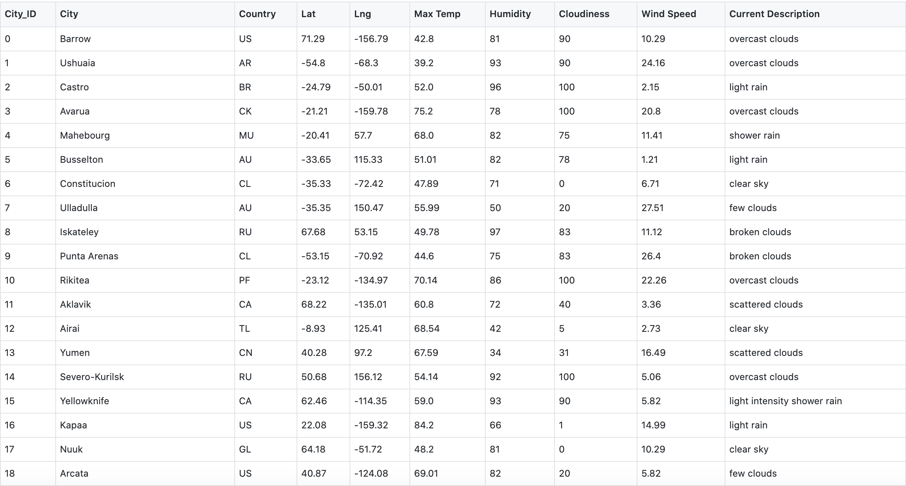
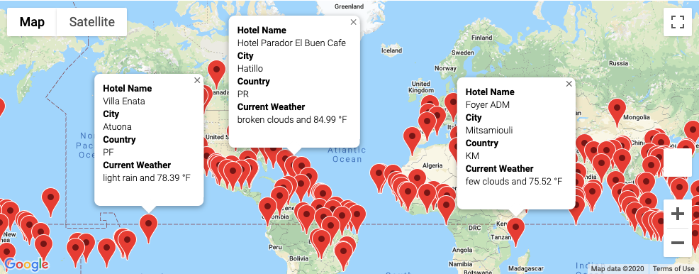

# World_Weather_Analysis

## Assignment
Jack loves the PlanMyTrip app. Beta testers love it too. And, as with any new product, they’ve recommended a few changes to take the app to the next level. Specifically, they recommend adding the weather description to the weather data. Then, you'll have the beta testers use input statements to filter the data for their weather preferences, which will be used to identify potential travel destinations and nearby hotels. From the list of potential travel destinations, the beta tester will choose four cities to create a travel itinerary. Finally, using the Google Maps Directions API, you will create a travel route between the four cities as well as a marker layer map.

This new assignment consists of three technical analyses. You will submit the following deliverables:
- Deliverable 1: Retrieve Weather Data

Generate a set of 2,000 random latitudes and longitudes, retrieve the nearest city, and perform an API call with the OpenWeatherMap. In addition to the city weather data you gathered in this module, use your API skills to retrieve the current weather description for each city. Then, create a new DataFrame containing the updated weather data.

- Deliverable 2: Create a Customer Travel Destinations Map

Use input statements to retrieve customer weather preferences, then use those preferences to identify potential travel destinations and nearby hotels. Then, show those destinations on a marker layer map with pop-up markers.

- Deliverable 3: Create a Travel Itinerary Map

Use the Google Directions API to create a travel itinerary that shows the route between four cities chosen from the customer’s possible travel destinations. Then, create a marker layer map with a pop-up marker for each city on the itinerary.

## Deliverable 1: Retrieve Weather Data
The script and output of deliverable 1 can be found under the Weather_Database folder within this github repository. Here are the files under the folder: 
- Weather_Database.ipynb: python script with the API calls and data retrieval 
- WeatherPy_Database.csv: output of the python script with the updated weather data 

Here's a screenshot of the first few rows of the updated weather data:

## Deliverable 2: Create a Customer Travel Destinations Map
The model of deliverable 2 can be found under the Vacation_Search folder within this github repository. Here are the files under the folder: 
- Vacation_Search.ipynb: python model that prompts user to enter minimum and maximum temperature preferences, searches for hotels based on user temperature preferences and displays marker layer map with qualifying hotels
- WeatherPy_vacation.csv: csv file with hotels based on user's temperature preferences

Here's a screenshot of the marker layer map from the python model: 

## Deliverable 3: Create a Travel Itinerary Map

